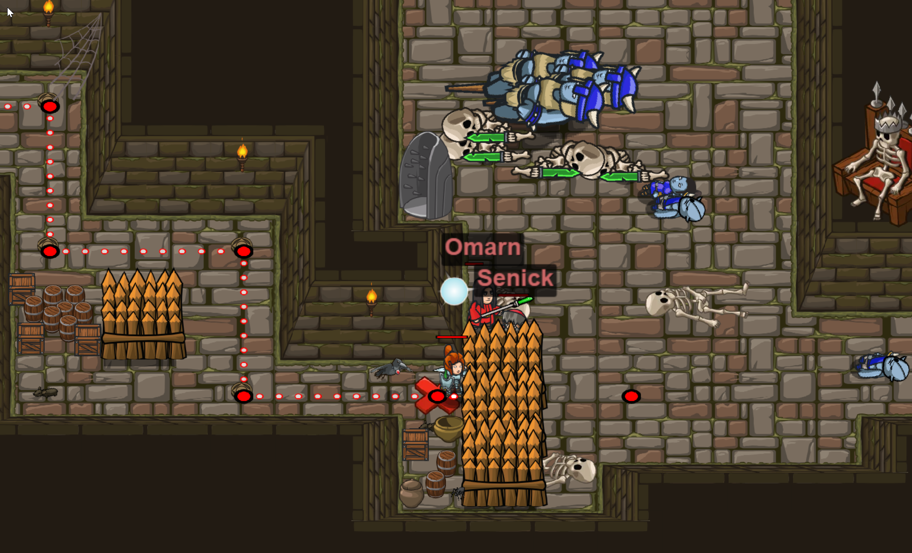

## ***Level 4:***  <span style="color: red">***Zeichen Und Böse Ohmen***

***In diesem Level habe ich gelernt, dass ich mit mit einem Befehl, mehr als nur einen Schritt machen kann, indem ich die Anzahl der Schritte in die Klammas schreibe.***



```Javascript
hero.moveRight();
hero.moveRight();
hero.moveUp();
hero.moveRight(3);
hero.moveDown();
hero.moveRight();
hero.moveDown();
hero.moveRight(2);
```